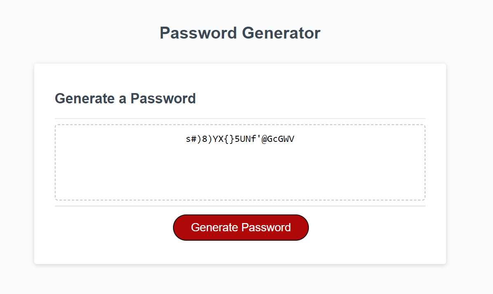

# <Password Generator>

## Description

This Weeks challenge was to create a password Generator with the following requirements: 

The application must:

Generate a password when the button is clicked.
Present a series of prompts for password criteria:
Length of password:
At least 10 characters but no more than 64.

Character types:
Lowercase
Uppercase
Numeric
Special characters ($@%&*, etc.)

Code should validate for each input and at least one character type should be selected.

Once all prompts are answered, the password should be generated and displayed in an alert or written to the page.

## Usage

To use simply load the page up and you will be given a prompt to fill in, This will be the foundation for the password

https://andrewowstyles.github.io/Password-Generator/

